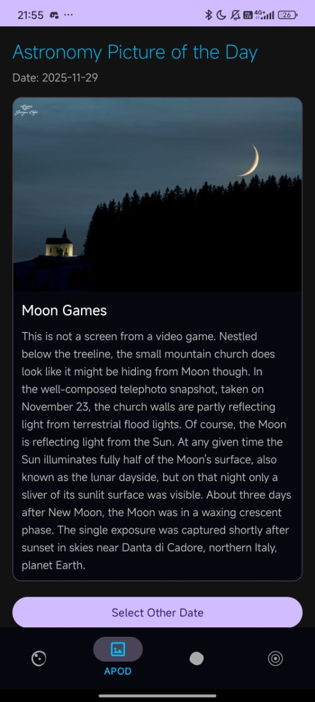
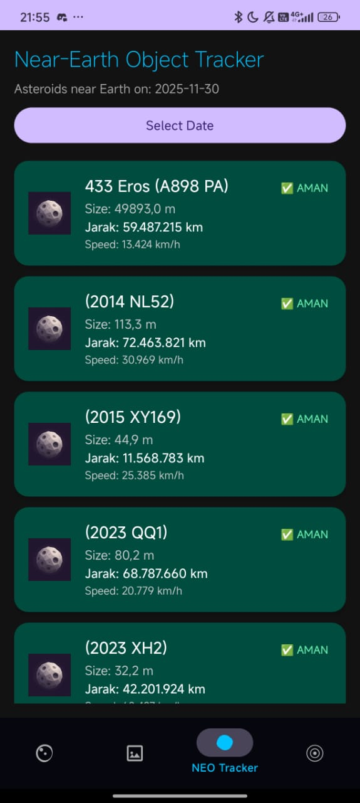
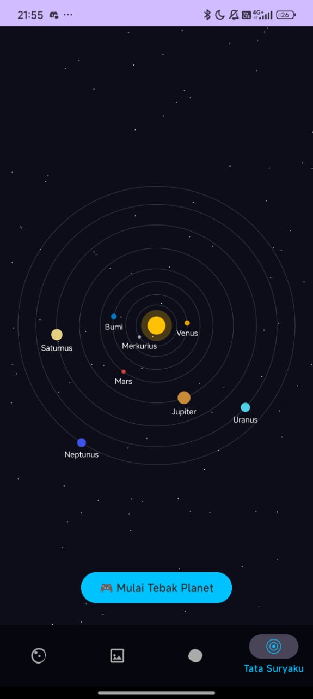

# 🚀 CosmoScope - Space Explorer App

**CosmoScope** adalah aplikasi edukasi Android yang mengajak pengguna menjelajahi keajaiban alam semesta. Aplikasi ini mengintegrasikan data *real-time* dari NASA dan kecerdasan buatan (AI) untuk memberikan pengalaman belajar yang interaktif dan menyenangkan.

---

## 📱 Fitur Utama (Screenshots)

Berikut adalah tampilan antarmuka aplikasi:

| **1. Astronomy Picture of the Day (APOD)** | **2. NEO Tracker (Asteroid Radar)** | **3. Tata Surya & Satelit** |
|:---:|:---:|:---:|
|  |  |  |
| Menampilkan foto astronomi harian dari NASA beserta penjelasan detail. Dilengkapi fitur **"Jelasin dong!"** yang menggunakan AI untuk menyederhanakan bahasa sains. | Memantau asteroid yang melintas dekat Bumi secara *real-time*. Kartu akan berubah warna (Merah/Hijau) berdasarkan jarak bahaya asteroid. | Simulasi interaktif tata surya dan satelit buatan. Pengguna dapat melihat orbit planet dan mendapatkan informasi detail. |

---

## ✨ Fitur Unggulan

* **🌌 Daily APOD:** Terintegrasi dengan NASA API untuk menampilkan foto/video harian. Mendukung zoom HD dan pemutaran video.
* **☄️ NEO Tracker:** Melacak *Near-Earth Objects* dengan indikator visual (Waspada/Aman) berdasarkan perhitungan jarak astronomi.
* **🪐 Solar System 2D:** Visualisasi orbit planet yang bergerak secara dinamis menggunakan *Custom Canvas View*.
* **🤖 AI Integration:**
    * **Space Quiz:** Kuis interaktif ala Duolingo untuk menentukan minat pengguna.
    * **AstroBot:** Chatbot pintar yang bisa menjelaskan fakta asteroid dan foto antariksa dengan bahasa yang mudah dimengerti (menggunakan API OpenRouter/Gemini).
* **🎨 UI Modern:** Desain antarmuka *Glassmorphism* dengan tema *Dark Space* yang elegan.

---

## 🛠️ Teknologi yang Digunakan

Aplikasi ini dibangun menggunakan:

* **Bahasa:** Java (Android Native)
* **Networking:** Retrofit2 & GSON (REST API Client)
* **Image Loading:** Glide
* **UI Components:** AndroidX, Material Design, CardView, RecyclerView
* **APIs:**
    * [NASA Open APIs](https://api.nasa.gov/) (APOD & NeoWs)
    * [OpenRouter / OpenAI](https://openrouter.ai/) (Untuk fitur Chatbot & Kuis)

---

## 📥 Cara Instalasi

1.  Clone repositori ini:
    ```bash
    git clone [https://github.com/cavinakbar6/CosmoScope.git
    ```
2.  Buka proyek di **Android Studio**.
3.  Biarkan Gradle melakukan sinkronisasi (*Sync Project*).
4.  Pastikan Anda memiliki koneksi internet.
5.  Jalankan aplikasi di Emulator atau Perangkat Fisik.

---

## 📝 Catatan Pengembang

Aplikasi ini dibuat sebagai proyek pembelajaran pengembangan Android, implementasi REST API, dan integrasi AI.

**Credits:**
* Data provided by NASA.
* AI intelligence powered by Gemini via OpenRouter.

---
